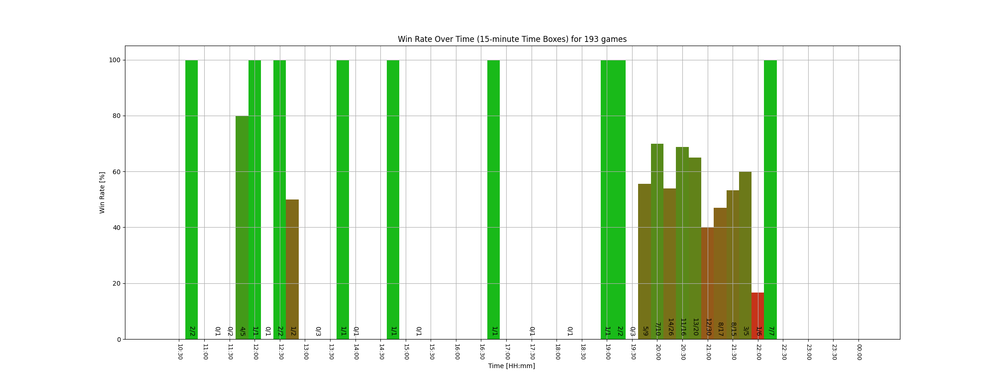

# Ranked analyzer

Query the RIOT API to visualize the match data

# Setup

- API Key from Riot Games (stored in a `.env` file)
  ```.env
  API_KEY = <YOUR API key>
  ```

# Usage

This repository contains several scripts to query the RIOT API and visualize the fetched match data.

## ``game_data_collector.py``

This script collects game data from the Riot Games API based on specified game name and tag.
It fetches match IDs associated with the provided player and retrieves match statistics for each match.
The collected data is then stored in a JSON file.

> **!!! The script will hit the rate limit imposed by the RIOT GAMES API  (after around 100 calls)!!**<br>
> To combat this a [WaitingStrategy](./utils/waiting_strategy.py) is used.
> In this case the Fibonacci sequence as waiting time. <- Look in the logs for more information.
> [Rate limit documentation.](https://developer.riotgames.com/docs/portal#web-apis_rate-limiting)

If you want to collect more that 100 games be prepared to "wait" a couple minutes!

Options

    -g, --game_name:    Name of the Summoner to fetch the data for.
    -t, --tag:          Tag associated with the player.
    -a, --amount:       Optional. Amount of matches to fetch (default is 100).
    -f, --filename:     Optional. Name of the output JSON file (default format: <game_name>#<tag>+<timestamp>).

### Usage

```shell
python game_data_collector.py -g <game_name> -t <tag> [-a <amount>] [-f <filename>]
```

___
__EXAMPLE__

```shell
python game_data_collector.py -g LeagueOfLegends -t Summoner123 -a 50 -f match_data
```

## ``render.py``
This script renders the collected data into a [bar chart](#example-visualization).

Options

    -p, --puuid:        The uuid of the player. (Can be seen in the log of the collector script).
    -if --input_file:   Name of the input file. (Output of the collector script).
    -f, --filename:     Optional. Name of the output PNG file.

### Usage

```shell
python render.py -p <puuid> -f <filename> -if <input_filename>
```

___
__EXAMPLE__

```shell
python render.py -if "./data/SergeantMoM#EUW+20240509-201538.json" -p "FM7RtQXU6BHpyzz-GeHjhf0pmLoy7mihAKcnSvo1SBEkcCWv-43eZYM2hcl_XzJFBzlLR4tdsapyDg" -f "plot.png"
```

# Example visualization
